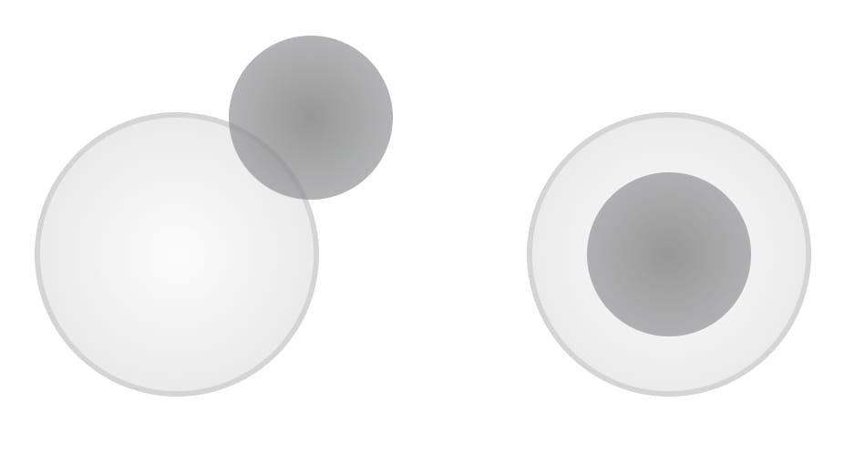

# Joystick Controller




A fully customizable JavaScript virtual joystick controller for both desktop and mobile devices supporting multi instances.
[Live Demo](https://joystick-controller.netlify.app)


## Installation

```
npm install joystick-controller
```
## Quick Start

```js
import JoystickController from 'joystick-controller';

const joystick = new JoystickController({}, (date) => console.log(data));
```
The import example here is module style import. JoystickController also supports global and commonJs import style.

## Options

You can pass a set of options as the first argument to further customize your joystick controller

| Name            | Type    | Default | Description                                                                      |
| --------------- | ------- | ------- | -------------------------------------------------------------------------------- |
| maxRange        | number  | 100     | Maximum range of the joystick dot (number of pixels)                             |
| level           | number  | 10      | Number of level of the joystick (eg 10 would return integers between -10 and 10) |
| radius          | number  | 50      | Radius of the joystick container (number of pixels)                              |
| joystickRadius  | 30      | number  | Radius of the joystick inner dot (number of pixels)                              |
| opacity         | number  | 0.8     | Opacity of the joystick                                                          |
| containerClass  | string  | ''      | Class for the joystick container for adding additional styles (outer container)  |
| controllerClass | string  | ''      | Class for the joystick controller for adding additional styles (inner container) |
| joystickClass   | string  | ''      | Class for the joystick dot for adding additional styles                          |
| leftToRight     | boolean | true    | Left to right adjustment (x position from left)                                  |
| bottomToUp      | boolean | true    | Bottom to up adjustment (y position from bottom)                                 |
| x               | string  | '50%'   | x position of the joystick controller on screen (equal to left/right of css)     |
| y               | string  | '50%'   | y position of the joystick controller on screen (equal to bottom/top of css)     |

## Callback Arguments

Joystick would trigger the callback on each move event. The following arguments are passed to the callback.
| Name | Type | Description |
| ------------- | ------------- | ------------- |
| x | number | x position of the joystick relative to the center of it
| y | number | y position of the joystick relative to the center of it
| leveledX | number | x position scaled and rounded to be a step between -level to level (level comes from options)
| leveledY | number | y position scaled and rounded to be a step between -level to level (level comes from options)
| angle | number | angle of the line between center of the joystick and position of the dot in radians
| distance | number | distance of the dot from the center joystick

## Customized Example

All the options are optional, but a customized instance would look like this:

```js
const joystick = new JoystickController(
  {
    maxRange: 70,
    level: 10,
    radius: 50,
    joystickRadius: 30,
    opacity: 0.5,
    leftToRight: false,
    bottomToUp: true,
    containerClass: "joystick-container",
    controllerClass: "joystick-controller",
    joystickClass: "joystick",
    x: "25%",
    y: "25%",
  },
  ({ x, y, leveledX, leveledY, distance, angle }) =>
    console.log(x, y, leveledX, leveledY, distance, angle)
);
```

## Clean Up

Run `destroy` function to clear all the event listeners and remove the joystick from the document

```js
joystick.destroy();
```

---

Copyright(c) Cyrus Mobini 2023

License MIT
